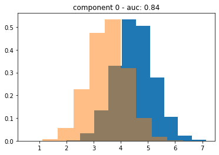

# Gaussian Mixture Data Generation For Binary Classification
> This package allows one to generate synethic data for binary classification tasks. Data is sampled from a pair of randomly generated mixtures of multidimensional gaussian distributions. The user can specify the dimensionality, acceptable AUC range of the posterior distibution and component irriducibility parameters.


## Install

`pip install syntheticDataGen`

# Examples

```python
from syntheticDataGen.dataset import generateParams
import matplotlib.pyplot as plt
import numpy as np
```

# Gaussian Mixture

```python
params0 = generateParams(2,1,[.65,.85],)
```

      0%|                                                                                                                                                     | 0/2 [00:00<?, ?it/s]

    isMetricSatisfied{'aucpn': 0.5, 'irreducibility': [0.0, 0.0]}
    anchorSetProp0.01
    Sigma Scale Perturb
    Sigma Ratios: [0.5 1. ]
    Sigma Ratios: [0.5 1. ]
    isMetricSatisfied{'aucpn': 0.61508872, 'irreducibility': [0.0252, 0.0]}
    anchorSetProp0.01
    Perturb Proportion
    isMetricSatisfied{'aucpn': 0.61408368, 'irreducibility': [0.0238, 0.0]}
    anchorSetProp0.01
    Mu Perturb
    isMetricSatisfied{'aucpn': 0.7842663599999999, 'irreducibility': [0.2502, 0.0]}
    anchorSetProp0.01
    Mu Perturb
    isMetricSatisfied{'aucpn': 0.6039854, 'irreducibility': [0.0222, 0.0]}
    anchorSetProp0.01
    Perturb Proportion
    isMetricSatisfied{'aucpn': 0.60306608, 'irreducibility': [0.0228, 0.0]}
    anchorSetProp0.01
    Perturb Proportion
    isMetricSatisfied{'aucpn': 0.6092671599999999, 'irreducibility': [0.022, 0.0]}
    anchorSetProp0.01
    Perturb Proportion
    isMetricSatisfied{'aucpn': 0.59984048, 'irreducibility': [0.0228, 0.0]}
    anchorSetProp0.01
    Sigma Scale Perturb
    Sigma Ratios: [0.25 1.  ]
    0.75
    Sigma Ratios: [0.375 1.   ]
    0.875
    Sigma Ratios: [0.4375 1.    ]
    0.9375
    Sigma Ratios: [0.46875 1.     ]
    0.96875
    Sigma Ratios: [0.484375 1.      ]
    0.984375
    Sigma Ratios: [0.4921875 1.       ]
    0.9921875
    Sigma Ratios: [0.49609375 1.        ]
    0.99609375
    Sigma Ratios: [0.49804688 1.        ]
    0.998046875
    Sigma Ratios: [0.49902344 1.        ]
    0.9990234375
    Sigma Ratios: [0.49951172 1.        ]
    0.99951171875
    Sigma Ratios: [0.49975586 1.        ]
    0.999755859375
    Sigma Ratios: [0.49987793 1.        ]
    0.9998779296875
    Sigma Ratios: [0.49993896 1.        ]
    0.99993896484375
    Sigma Ratios: [0.49996948 1.        ]
    0.999969482421875
    Sigma Ratios: [0.49998474 1.        ]
    0.9999847412109375
    Sigma Ratios: [0.49999237 1.        ]
    0.9999923706054688
    Sigma Ratios: [0.49999619 1.        ]
    0.9999961853027344
    Sigma Ratios: [0.49999809 1.        ]
    0.9999980926513672
    Sigma Ratios: [0.49999905 1.        ]
    0.9999990463256836
    Sigma Ratios: [0.49999952 1.        ]
    0.9999995231628418
    Sigma Ratios: [0.49999976 1.        ]
    0.9999997615814209
    Sigma Ratios: [0.49999988 1.        ]
    0.9999998807907104


    100%|█████████████████████████████████████████████████████████████████████████████████████████████████████████████████████████████████████████████| 2/2 [00:00<00:00,  5.61it/s]

    Sigma Ratios: [0.49999994 1.        ]
    0.9999999403953552
    Sigma Ratios: [0.49999997 1.        ]
    0.9999999701976776
    Sigma Ratios: [0.49999999 1.        ]
    0.9999999850988388
    Sigma Ratios: [0.49999999 1.        ]
    0.9999999925494194
    Sigma Ratios: [0.5 1. ]
    0.9999999962747097
    Sigma Ratios: [0.5 1. ]
    0.9999999981373549
    Sigma Ratios: [0.5 1. ]
    0.9999999990686774
    Sigma Ratios: [0.5 1. ]
    0.9999999995343387
    Sigma Ratios: [0.5 1. ]
    0.9999999997671694
    Sigma Ratios: [0.5 1. ]
    0.9999999998835847
    Sigma Ratios: [0.5 1. ]
    0.9999999999417923
    Sigma Ratios: [0.5 1. ]
    0.9999999999708962
    Sigma Ratios: [0.5 1. ]
    0.9999999999854481
    Sigma Ratios: [0.5 1. ]
    0.999999999992724
    Sigma Ratios: [0.5 1. ]
    0.999999999996362
    Sigma Ratios: [0.5 1. ]
    0.999999999998181
    Sigma Ratios: [0.5 1. ]
    0.9999999999990905
    Sigma Ratios: [0.5 1. ]
    0.9999999999995453
    Sigma Ratios: [0.5 1. ]
    0.9999999999997726
    Sigma Ratios: [0.5 1. ]
    0.9999999999998863
    Sigma Ratios: [0.5 1. ]
    0.9999999999999432
    Sigma Ratios: [0.5 1. ]
    0.9999999999999716
    Sigma Ratios: [0.5 1. ]
    0.9999999999999858
    Sigma Ratios: [0.5 1. ]
    0.9999999999999929
    Sigma Ratios: [0.5 1. ]
    0.9999999999999964
    Sigma Ratios: [0.5 1. ]
    0.9999999999999982
    Sigma Ratios: [0.5 1. ]
    0.9999999999999991
    Sigma Ratios: [0.5 1. ]
    0.9999999999999996
    Sigma Ratios: [0.5 1. ]
    0.9999999999999998
    Sigma Ratios: [0.5 1. ]
    0.9999999999999999
    Sigma Ratios: [0.5 1. ]
    1.0
    Sigma Ratios: [0.5 1. ]
    Sigma Ratios: [0.5 1. ]
    isMetricSatisfied{'aucpn': 0.6064006800000001, 'irreducibility': [0.0234, 0.0]}
    anchorSetProp0.01
    Sigma Scale Perturb
    Sigma Ratios: [1. 1.]
    Sigma Ratios: [1. 1.]
    isMetricSatisfied{'aucpn': 0.5, 'irreducibility': [0.0, 0.0]}
    anchorSetProp0.01
    Mu Perturb
    isMetricSatisfied{'aucpn': 0.83789376, 'irreducibility': [0.193, 0.2002]}
    anchorSetProp0.01
    isMetricSatisfied{'aucpn': 0.5, 'irreducibility': [0.0, 0.0]}
    anchorSetProp0.01
    Mu Perturb
    isMetricSatisfied{'aucpn': 0.7628476000000001, 'irreducibility': [0.05, 0.043]}
    anchorSetProp0.01
    0 1 1.7636393116770788


    


    0 1 2.2547747161844143


```python
X,y,componentAssignment,XPos,XNeg,componentAssignmentPos,componentAssignmentNeg = params0.dg.pn_data(100000)
```

```python
fig,ax = plt.subplots(2,1,figsize=(4,8),sharex=True)
binvalsPos, bins, patches = ax[0].hist(X[y.ravel()].ravel(),density=True)
binvalsNeg,_,_ = ax[0].hist(X[~y.ravel()].ravel(),density=True,alpha=.5,bins=bins)
rng = np.arange(X.min(),X.max(),.01)
ax[1].plot(rng,params0.dg.pn_posterior(rng))
ax[1].set_title("posterior distribution")
# ax[1].scatter((bins[:-1]+bins[1:])/2,binvalsPos/(binvalsPos+binvalsNeg))
```


    Text(0.5, 1.0, 'posterior distribution')


```python
from sklearn import metrics
```

Overall distribution might not have posterior in the given range; here all the 

```python
metrics.roc_auc_score(y,params0.dg.pn_posterior(X))
```


    0.9463780887594025


The posterior distribution will result in an AUC in the specified range when evaluated on each component

```python
for k in np.unique(componentAssignment).astype(int):
    Xk,yk = X[componentAssignment==k],y[componentAssignment==k]
    plt.hist(Xk[yk],density=True)
    plt.hist(Xk[~yk],alpha=.5,density=True)
    plt.title(f"component {k} - auc: {metrics.roc_auc_score(yk,params0.dg.pn_posterior(Xk)):.2f}")
    plt.show()
```





## Multivariate Gaussian Example

Generate a dataset comprised of 3 clusters in 2 dimensions each with an AUC in the range $[.6, .8]$

```python
params1 = generateParams(3,2,[.6,.8],)
```

    100%|█████████████████████████████████████████████████████████████████████████████████████████████████████████████████████████████████████████████| 3/3 [00:00<00:00, 20.50it/s]


    isMetricSatisfied{'aucpn': 0.5, 'irreducibility': [0.0, 0.0]}
    anchorSetProp0.01
    Perturb Proportion
    isMetricSatisfied{'aucpn': 0.5, 'irreducibility': [0.0, 0.0]}
    anchorSetProp0.01
    Mu Perturb
    isMetricSatisfied{'aucpn': 0.7584392399999998, 'irreducibility': [0.0458, 0.0456]}
    anchorSetProp0.01
    isMetricSatisfied{'aucpn': 0.5, 'irreducibility': [0.0, 0.0]}
    anchorSetProp0.01
    Mu Perturb
    isMetricSatisfied{'aucpn': 0.75774036, 'irreducibility': [0.0418, 0.0458]}
    anchorSetProp0.01
    isMetricSatisfied{'aucpn': 0.5, 'irreducibility': [0.0, 0.0]}
    anchorSetProp0.01
    Sigma Shape Perturb
    Sigma Ratios: [1.         0.39568147]
    Sigma Ratios: [1.         0.94503512]
    Sigma Ratios: [1.         0.94503512]
    isMetricSatisfied{'aucpn': 0.62142496, 'irreducibility': [0.0046, 0.009]}
    anchorSetProp0.01
    Perturb Proportion
    isMetricSatisfied{'aucpn': 0.61857888, 'irreducibility': [0.0062, 0.009]}
    anchorSetProp0.01
    Perturb Proportion
    isMetricSatisfied{'aucpn': 0.6108399200000001, 'irreducibility': [0.005, 0.0098]}
    anchorSetProp0.01
    Sigma Shape Perturb
    Sigma Ratios: [0.87481754 1.        ]
    Sigma Ratios: [0.87481754 1.        ]
    isMetricSatisfied{'aucpn': 0.68711728, 'irreducibility': [0.0504, 0.0332]}
    anchorSetProp0.01
    0 1 3.244209950978152
    0 2 0.15241730472496465
    0 2 1.1204130079914014
    1 2 0.7962243110243253
    1 2 4.988468364214936
    0 1 3.4530778573558436


```python
params1.plotCIEllipse()
```


```python
results2D = params1.dg.pn_data(5000)
```

```python
[r.shape for r in results2D]
```


    [(5000, 2), (5000, 1), (5000, 1), (2353, 2), (2647, 2), (2353, 1), (2647, 1)]


positive class conditional distribution weights

```python
params1.dg.dist_p.mixProp
```


    array([0.40830413, 0.14546069, 0.44623518])


negative class conditional distribution weights

```python
params1.dg.dist_n.mixProp
```


    array([0.27782571, 0.05971392, 0.66246037])


```python
plt.scatter(*results2D[0][results2D[1].ravel()].T)
plt.scatter(*results2D[0][~results2D[1].ravel()].T,alpha=.5)
```


    <matplotlib.collections.PathCollection at 0x7f353f6fe370>


